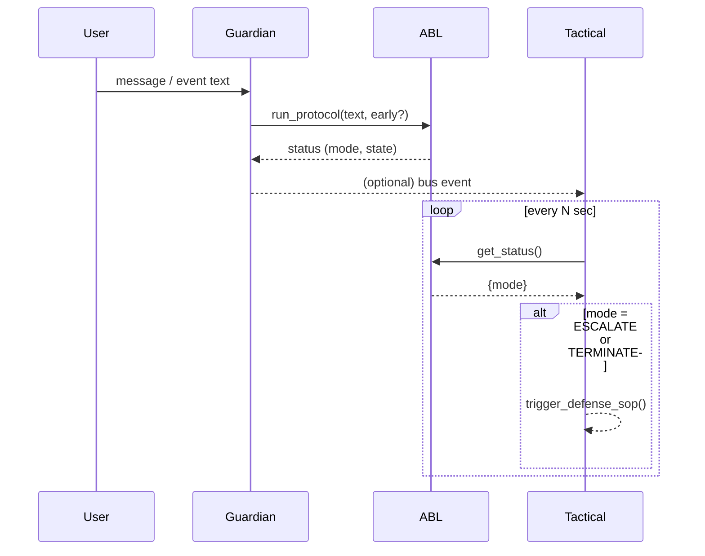

```text
eudaimonia/
└── core/
    ├── abl_core.py       # main engine (FSM, enums, memory)
    ├── abl_config.json   # threat→mode map + keywords + form labels
    └── __init__.py
tests/
└── test_abl_core.py      # unit tests (21 ✓)
docs/
├── ABL_Master_Directive.md
└── ABL_Struct.md
```


